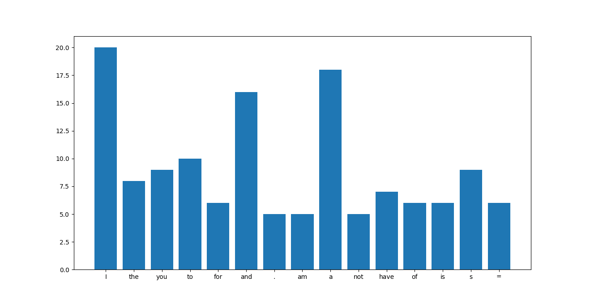

# Data Analysis for daily key log
Python functions that reads the log of my daily computer activity and analyze it.
[here is the keylogger I wrote](https://github.com/MustafaAnasKH99/Keylogger-for-Data-Analyses).

**Check issues for the progress tracking**.

Keylogger's daily average result:

-----
Feel free to follow me.

.

